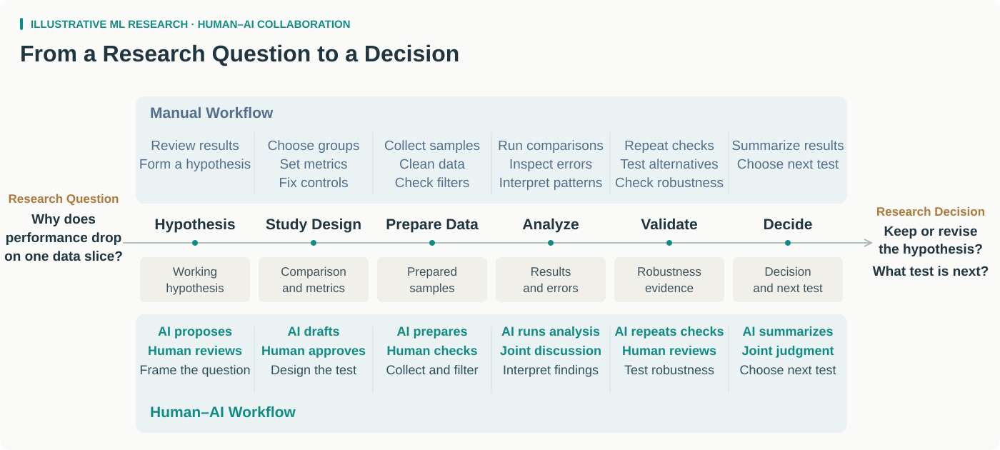
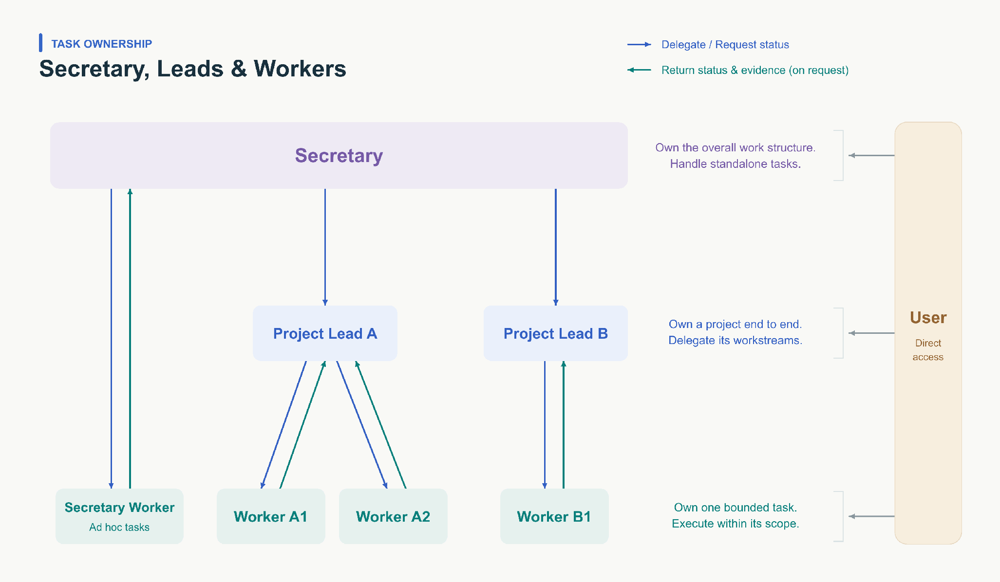
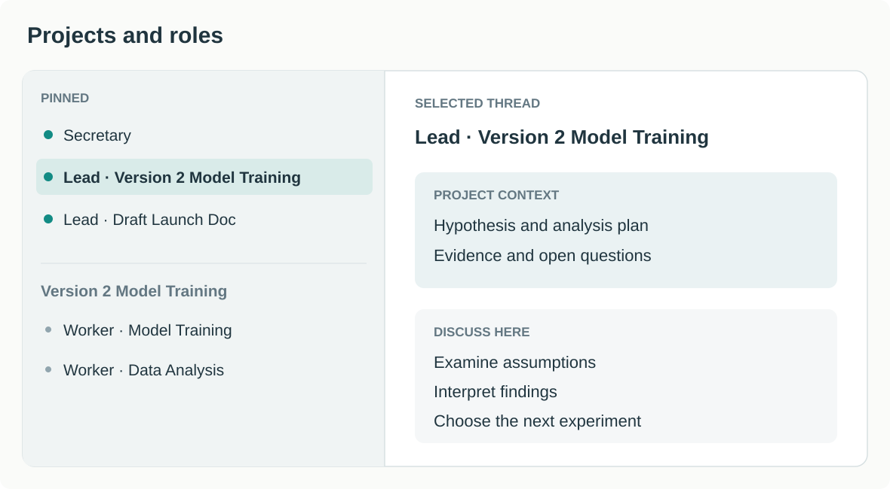
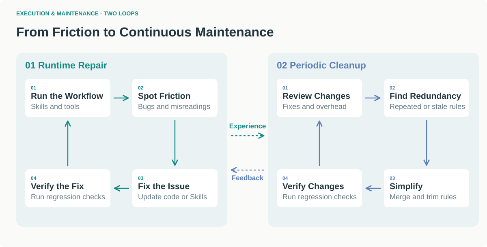
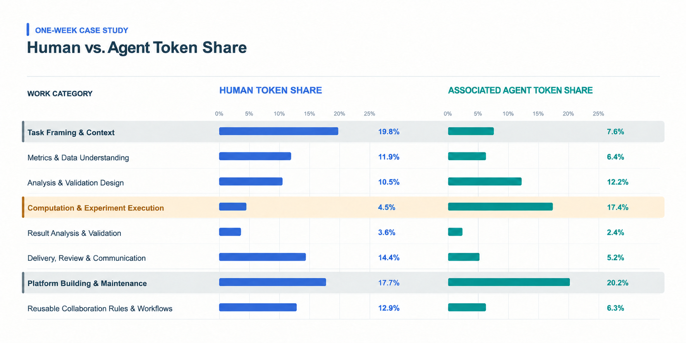

AI is a powerful research tool. I have been exploring how it can support my research workflow and how to organize that collaboration effectively.

## 1. From Manual Work to Human–AI Collaboration

A typical ML investigation moves from a hypothesis through data analysis and validation to a decision (Figure 1).

- **AI:** handles data preparation, query execution, and repeated checks.
- **My role:** frames the question and interprets the evidence.



*Figure 1. A general ML investigation, with and without agent assistance.*

## 2. Organizing Roles and Responsibilities

### The problem

Mixing many responsibilities in one context creates friction for both of us.

- **For the agent:** unrelated background, files, and instructions can interfere with the current task.
- **For me:** I need to know who holds the relevant context, where to discuss a question, and where to track the results.

### The approach

I gave each role a clear responsibility and kept a consistent discussion thread for each project (Figure 2):

- **Secretary:** coordinates across projects and helps organize the overall work.
- **Lead:** focuses on one project, discusses the approach, breaks down tasks, and integrates results.
- **Worker:** executes a bounded task and returns evidence and unresolved issues.

This organization helps us in two ways:

- **Focused context:** each role has a defined scope, with the relevant background, files, procedures, and task state. This makes information easier to find and reduces interference from unrelated work.
- **Clear ownership:** I can go directly to the agent that holds the relevant context and follow decisions and results in its thread.



*Figure 2. Role boundaries and task ownership.*

I use Codex's sidebar to keep these threads organized by project and role (Figure 3). The labels make each thread's purpose visible, so I can return to the right context when I need it.



*Figure 3. Pinned Leads, project-specific Workers, and the selected Lead's context.*

### In practice

- **Discussing the hypothesis:** I first discussed the hypothesis with the Secretary, who suggested setting up a dedicated Lead to take the investigation forward.
- **Coordinating the analysis:** I worked mainly with the Lead on the validation plan. Workers gathered cases and analyzed samples; the Lead combined the findings from two rounds of investigation. I also clarified specific issues directly with Workers, then brought their results back to the project discussion.

This kept the main discussion focused on research decisions while Workers handled specific tasks.

## 3. Memory and Knowledge Organization

### The problem

When project knowledge is scattered across conversations and files, I have to repeat context and search for earlier decisions.

### The approach

Drawing on [LangChain's discussion of memory for agents](https://www.langchain.com/blog/memory-for-agents), I organized project knowledge into three categories:

- **Semantic memory:** project goals, terminology, and data definitions.
- **Episodic memory:** experience and decisions. Experiment records explain why an experiment began, how it evolved, and how it ended; study records preserve focused investigations.
- **Procedural memory:** reusable operating methods, including Skills, scripts, and reference material.

```text
<project>
├── AGENTS.md
├── CURRENT.md              Current snapshot · Required on entry
├── context/                Semantic memory
│   ├── AGENTS.md
│   ├── INDEX.md
│   └── <topic>.md
├── experiments/            Episodic memory · Experiment lifecycle
│   ├── AGENTS.md
│   ├── model-training/
│   │   ├── INDEX.md
│   │   └── <version>/
│   └── ab-testing/
│       └── INDEX.md
├── studies/                Episodic memory · Focused investigations
│   ├── AGENTS.md
│   ├── INDEX.md
│   └── <study>/
└── workflow/               Procedural memory
    ├── AGENTS.md
    └── <procedure>/
        ├── SKILL.md
        ├── scripts/
        └── references/
```

The folder structure also needs clear rules for what gets recorded and how it is retrieved:

- **Writing:** each directory's `AGENTS.md` defines what belongs there and how to record and maintain it. Agents save new information in the appropriate place and update the index so later tasks can find it.
- **Reading:** start each project session with `CURRENT.md`. It captures the current state, the main bottleneck, and the next decision. Use indexes or workflow guides to retrieve more detail only when needed.

### In practice

- **Checking definitions:** the agent used the context index to find sample and outcome definitions.
- **Finding prior experiments:** experiment indexes led to the relevant model and experiment records.
- **Gathering examples:** workflow guides led to the appropriate Skill, scripts, and references.
- **Saving findings:** results went into `studies/`, following the project's recording rules, so later work could use them.

These entry points let agents find the background without asking me to repeat it. I could focus on the current question and check the assumptions and interpretation.

## 4. From Runtime Friction to Continuous Maintenance

### The problem

Bugs and misunderstandings need fixing quickly. But adding another instruction or checkpoint after every failure creates clutter and makes the workflow harder to maintain.

### The approach

I use two loops: fix problems as they arise, then periodically clean up the changes (Figure 4).

- **Runtime repair:** triggered by feedback. When I identify a bug or a misunderstood definition, a Hook can initiate a repair, update the code or Skill, and run regression checks to verify the change.
- **Periodic cleanup:** triggered on a schedule. An Automation can review recent fixes, merge duplicate guidance, remove outdated checks and redundant gates, and run regression checks on the simplified workflow.

Hooks and scheduled jobs can implement these loops, but they need to be tested.



*Figure 4. Runtime repair and periodic cleanup.*

### In practice

- **Clarifying a definition:** after an agent misunderstood a sampling rule, we added the default definition to the relevant Skill so future runs would read it.
- **Cleaning up guidance:** periodic review helps consolidate instructions added after failures, reducing repetition and ambiguity.

People still judge the problem and the proposed fix. The system can trigger routine follow-up, so I do not have to schedule every repair or remember every maintenance task.

## 5. Where Human Attention Goes

The clearest change was where I focused my attention.

- **My work:** I spent more time defining the problem, organizing context, and building and maintaining the workflow.
- **AI's work:** agents handled more of the computation and experiment execution.

Figure 5 illustrates this pattern with a one-week work log:



*Figure 5. Human token share and associated agent token share across work categories.*

Computation and experiment execution accounted for a small share of human tokens but a larger share of associated agent tokens. Human tokens were more concentrated in task framing, context, and platform building and maintenance.
