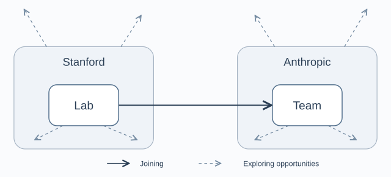

I’ve been thinking about how community can help me find the work I want to do and build a path toward it. A friend’s experience gives me a concrete starting point for exploring that process.

## The framework

## Two layers of community

**The broader community: shared identity and reach.** Organizations such as universities and companies provide resources, wider information networks, and a shared identity. That identity may make it easier to start a conversation, but it does not amount to a deep understanding of an individual's capabilities.

**The smaller community: working together and getting to know one another.** Labs and teams provide settings for sustained collaboration. People see how others think, solve problems, and take responsibility. Over time, they develop an informed appreciation of one another's abilities.

## Three conditions a broader community can provide

| Condition | How it works | What it enables |
| --- | --- | --- |
| **Access within the organization** | Membership and internal channels for participation create openings to approach or join specific teams. | This may lower the barrier to entering a smaller community, turning an existing affiliation into an opportunity for deeper involvement. |
| **Exchange within the organization** | A shared identity and internal channels of communication make it easier for people across teams to start conversations. | This broadens access to information about different problems, perspectives, and potential collaborations. |
| **External credibility** | An organization's recognizable identity and reputation give others an initial sense of a person's background. | This may make people outside the organization more willing to respond or engage, extending access to information and connections. |

## Three things we build through close collaboration

| What we build | How it develops | What it enables |
| --- | --- | --- |
| **A body of work** | We take responsibility for concrete problems and complete research or systems work, producing contributions that others can see and evaluate. | This makes our capabilities visible and gives others concrete evidence when considering whether to collaborate with us. |
| **Learning** | We observe how others think, participate in solving problems, and learn through feedback and revision in day-to-day work. | We turn others' experience into methods of our own, improving our ability to understand and solve problems. |
| **Trust** | We demonstrate capability and reliability through sustained collaboration, allowing others to develop an informed understanding of what we can do. | Collaborators become willing to work with us again, recommend us, or introduce us to others, helping open the next opportunity. |

These three develop alongside and reinforce one another: making visible contributions, continuing to learn through practice, and building trust through collaboration.

**A broader community provides openings and a wider flow of information. A smaller community turns some of those possibilities into experience, contributions, and trust through actual collaboration. What we build then helps open the next connection.**

## Moving between communities

| Part of the process | The central question | What it draws on |
| --- | --- | --- |
| **Exploration** | Why do I want to work with them? | Information and conversations across both broader and smaller communities help us discover, understand, and choose opportunities. |
| **Building a foundation** | Why would they want to work with me? | Actual capability and contributions, together with the recognition and recommendations of collaborators. |

**Exploration helps us find somewhere worth going. What we have built gives others a reason to welcome us.**
