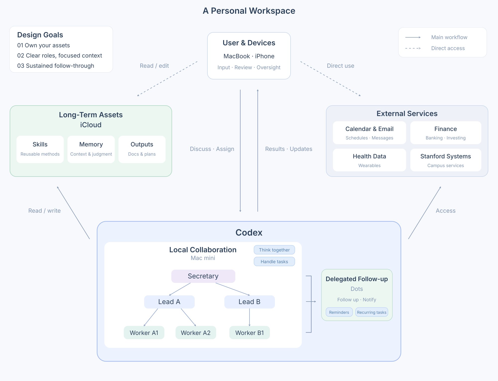

After trying [Muse](https://introducing.muse.ai/) and OpenAI’s [Dots](https://learn.chatgpt.com/docs/dots), I see them as fairly mature personal agent products. I think of it as a personal secretary: if I ask it to arrange dinner, it learns the necessary preferences, finds a restaurant, confirms the arrangement with me, and reminds me before I leave.

**The important part is follow-through.** Remembering to check progress and prompt an agent again takes effort. I want to hand over a clear responsibility and have someone keep it moving, involving me when needed. That frees attention for the things I care most about.

*Personal Workspace Framework*

## 1. Organize Work Around My Attention

A personal assistant can handle everyday tasks and follow-up. My life also includes research, career decisions, learning, and projects that need sustained discussion. Those deserve stable places to think and build.

I organize the local workspace around three roles:

- **Secretary:** handles general requests and coordination across domains.
- **Lead:** maintains continuity within a domain, discusses direction, and handles small tasks.
- **Worker:** holds the focused context for a project that needs ongoing work and my deeper involvement.

**Each visible chat thread is a commitment of my attention.** I can speak directly with any of these roles, and I want the threads I keep visible to reflect the problems I am actively thinking about.

Dots handles routine follow-up and brings reminders and results back to me. Secretary, Leads, and Workers can all delegate suitable tasks to it, including:

- **Reminders:** keep track of agreed matters and notify me when something needs my attention.
- **Recurring tasks:** carry out clearly defined work on a schedule and deliver the results, such as a morning brief or a regular review.

| State of the work | Who handles it |
| --- | --- |
| A straightforward, one-off task | Secretary or the relevant Lead, in its local chat thread. |
| The goal or approach still needs discussion | The relevant Lead or Worker, for continued discussion and project work. |
| The goal and approach are clear; I only need to check, advise, or approve occasionally | Dots, for execution and follow-up. |
| A recurring service has clear rules | Dots, for scheduled execution and delivery. |

A complex project can reach a stage where its next steps are ready to delegate. The deciding factor is how deeply I still need to participate. A handoff carries the goal, current state, next step and trigger, when to involve me, and how the task ends. If a new question needs deeper thought, I return to the project conversation with its context intact.

## 2. One Workspace Across Devices

Cloud computers appeal to me, but logins and device-trust checks create friction. Each external service has its own security requirements, which can make reliable access difficult to maintain. For now, I use a Mac mini as the execution environment, with my existing files and signed-in services.

In this design, my phone and MacBook access the same workspace on the Mac mini, with shared files and task state. Switching devices should let me continue the work with its context intact.

## 3. Assets I Can Control and Keep

Working with agents produces reusable procedures, accumulated context and judgments, and finished work. These become personal assets when I can preserve, inspect, and shape them.

The asset store in the diagram has three parts:

- **Skills:** methods and procedures worth using again.
- **Memory:** relevant experience, preferences, background, and judgments.
- **Reusable work:** documents, plans, and other completed outputs.

I want to know where these assets live, edit and reorganize them myself, and reuse them across harnesses. This gives me control over what the agent knows about me and how it uses my accumulated experience and work.
