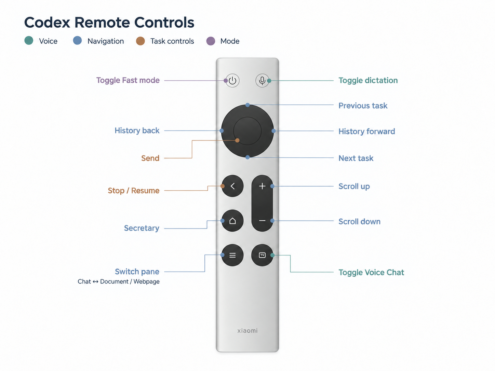
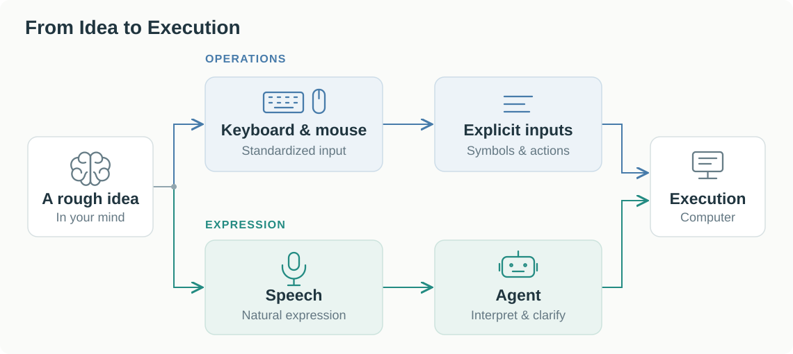

I turned a small Bluetooth remote into a controller for Codex. I use speech to develop ideas and a few buttons to control dictation, switch tasks, and scroll (Figure 1).

*Figure 1. The remote's button mapping for Codex.*

## 1. From Operations to Expression

A keyboard turns keystrokes into standardized symbols and commands. In an operation-driven workflow, I have to translate what I want into inputs and steps the system can follow.

An LLM-based agent can work with less structured expression: incomplete thoughts, rough descriptions, and revisions along the way. It can help clarify the goal, organize the information, and turn it into actions. I can begin the conversation before I have worked out a complete instruction (Figure 2).

*Figure 2. Two paths from an idea to execution.*

If speech carries the expression and the agent handles the steps, a full keyboard may be more than this workflow needs. I tried a small remote to find out which controls were still worth keeping.

## 2. Why Still Keep a Few Buttons?

Some actions are already clear and need to happen immediately. Giving another spoken instruction to trigger them adds effort. I kept a few controls within reach:

- **Dictation:** start or stop speech input.
- **Task controls:** send a message, pause work, or control Voice Chat.
- **Navigation:** switch tasks and scroll through the conversation or document.

These are frequent actions with little to explain. A button lets me trigger them directly while speech carries the content of the conversation. Sound and the screen provide feedback so I can see what happened and decide what to do next.

This is why the keyboard can shrink to a few controls in this setup. The agent handles more of the intervening steps, while I retain direct control over input, timing, and navigation.

## 3. When Direct Operation Works Better

The value of expression depends on how clear my intention already is:

- **Clear intent, simple action:** take capturing part of the screen as an example. I can see the area I want, drag to select it, and check the screenshot immediately. This short feedback loop between my eyes and hand takes less effort than describing the area and waiting for an agent to capture it. A verbal description can also lose spatial detail.
- **Intent still taking shape:** when I have a rough idea, expressing it and discussing it with an agent helps clarify the goal. The conversation itself helps me work out what I want to do.

## 4. What the Remote Actually Changes

The remote is convenient because it stays in my hand. I can trigger a small action without reaching for the keyboard or changing position, which makes the interaction feel more comfortable. Its gain in task efficiency may be limited: standard keyboard shortcuts can perform the same actions just as quickly.

Speech also has a cost. After a discussion lasting more than an hour, I was tired of talking and wanted to type. For tasks such as entering a password, a keyboard still provides exact, standardized input. As authentication changes, will typing a password still be necessary, and how much of a full keyboard will future interfaces need? These remain questions worth exploring.
